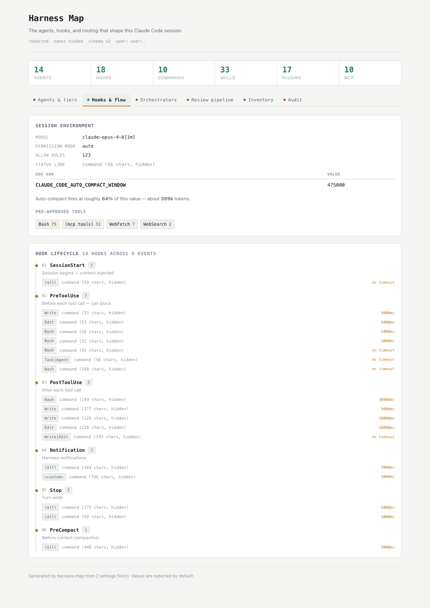
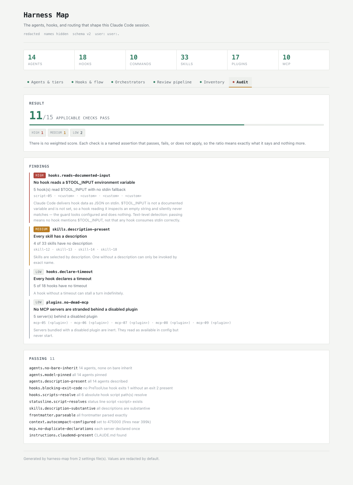

<h1 align="center">harness-map</h1>

<p align="center">
  <a href="https://github.com/staqsIO/harness-map/actions/workflows/ci.yml"></a>
  <a href="LICENSE"></a>
  
  
</p>

<p align="center"><strong>See what your Claude Code setup actually does — agents by model tier, hooks across the session lifecycle, orchestrator routing, and the review pipeline — as one interactive page.</strong></p>

<p align="center">
  
</p>

Claude Code configuration accretes. Agents in one directory, hooks in
`settings.json`, routing conventions in prose, plugins from four marketplaces,
MCP servers declared in four different places. Nothing shows you what you have.

`harness-map` reads all of it, draws it, and **checks it** — which is how the
author found five hooks in their own config that had never worked.

```bash
/plugin marketplace add staqsIO/harness-map
/plugin install harness-map
/harness-map
```

## What it shows

| View | Source | Works without config? |
|---|---|---|
| **Agents & tiers** | `agents/*.md` frontmatter | needs `agents/` |
| **Hooks & flow** | `settings.json` hooks, env, permissions | needs `settings.json` |
| **Orchestrators** | your routing rules | falls back to built-in defaults |
| **Review pipeline** | your review/verifier rules | shows what to add |
| **Inventory** | commands, skills, plugins, MCP servers, rules | always |
| **Audit** | all of the above | always |

Structural facts come from a deterministic scanner. Only the two prose-backed
views involve model interpretation, and each degrades to an explicit empty state
naming what is missing — the map never invents a routing rule you did not write.

## Audit

<p align="center">
  
</p>

```bash
node scripts/audit-harness.mjs --scan scan.json
```

> [!NOTE]
> Exits non-zero only on a **high**-severity failure, so it works as a CI gate.

**There is no composite score, on purpose.** Every check is a named assertion
that returns pass, fail, or n/a with concrete evidence. A weighted 0–100 number
would be this author's guesses about weights dressed up as measurement, and "you
have 132 skills" is not a strength — it is more trigger-collision surface to
maintain. A check that cannot apply (no agents defined, so no agent checks) is
**n/a rather than a failure**, which is what keeps the ratio comparable across
very different configs.

<details>
<summary><strong>What it asserts, and why each one is falsifiable rather than a matter of taste</strong></summary>

<br>

- **Hook scripts that do not exist on disk** — the guard looks configured in
  `settings.json` and silently never runs.
- **Bare `inherit` agents** — an agent with `model: inherit` adopts the session
  model, so a subagent written to be cheap can run at the top tier's price with
  nothing in the config making that visible.
- **MCP servers stranded behind a disabled plugin** — present in config, never
  started.
- **Skills with a missing or very short `description`** — routing is driven by
  the description, so a thin one fires inconsistently.
- **Auto-compact threshold** — `CLAUDE_CODE_AUTO_COMPACT_WINDOW` fires at roughly
  **84%** of the value you set, not at the value. The audit does the arithmetic.
- **Two hook-contract mistakes** — a hook reading a `$TOOL_INPUT` environment
  variable (which Claude Code does not set; the event arrives as JSON on stdin),
  and a `PreToolUse` hook exiting `1` (non-blocking) where only `2` blocks. Both
  are **defect detectors, not proofs**: they found five dead guards in the
  author's own config, but not finding one says nothing about whether a hook
  blocks — see [what this tool does not check](#what-this-tool-does-not-check).

</details>

## Privacy

The default document contains **only shapes that cannot carry a secret**: counts,
booleans, enumerations, paths relative to a scanned root, and **opaque stable
labels** (`agent-01`, `skill-03`) in place of names you authored.

| Flag | Adds | Shareable? |
|---|---|---|
| *(default)* | structure only | yes, by construction |
| `--include-prose` | authored names, descriptions, rule headings | only after you read it |
| `--include-values` | raw configuration values | no |

> [!IMPORTANT]
> The screenshots above are real output from the author's own config, generated
> with no flags. Every agent, skill and MCP server appears as an opaque label —
> that is the default, not a redacted screenshot.

<details>
<summary><strong>Why the document is built from a declaration instead of filtered on the way out</strong></summary>

<br>

`scripts/emit-schema.mjs` declares every field the output may contain and the
shape each one must have; `gate()` constructs the document from that declaration.
A field that is not listed there cannot appear, no matter what the scanners
produce — so a field added to Claude Code, or to this tool, defaults to *absent*
rather than to *emitted*.

That design is the direct result of getting it wrong the other way. Redacting at
each emission site protects the fields someone thought about, and successive
adversarial reviews each found fields nobody had: `settings.model`,
`statusLine.type`, `permissions.defaultMode`, `mcpServers[].type`, agent `model`,
hook defect labels, plugin `scope`, marketplace `type`, the key quoted inside a
parse-warning message, rule filenames behind `proseRefs`. Every fix was correct
and every round found more, because "no authored text anywhere" is a universal
negative over a surface that keeps growing. One declaration is checkable by
reading one file; fifteen scattered decisions are not.

Emitters answer *what shape may this field be*, never *does this value look like
a secret* — pattern-matching for secrets is what failed first. A pattern-based
blocklist leaked `SERVICE_URL=postgres://admin:pw@host` verbatim, because the key
was not secret-shaped and the value was not a branded token.

Rule files are read for headings only, and **symlinks are never followed** out of
the configuration tree, so a symlinked `rules/*.md` cannot route an arbitrary
local file into a published page. The rendered page is fully self-contained: no
external scripts, fonts, or images.

</details>

## What this tool does NOT check

It does not verify that your safety hooks actually **block** anything.

Three implementations of that check were built and all three were removed,
because each produced a false PASS — a report of protection you do not have,
which is worse than no report at all:

- Matching a hook's command text passes a hook whose body is
  `echo 'rm -rf, drop table' >/dev/null; exit 0`.
- Detecting `exit 1` (which does not block; only exit 2 does) is defeated by
  `exit 1; # unreachable` followed by a dead `exit 2`.
- Executing hooks against synthetic input passes a hook whose matcher is
  `NotBash`, which Claude Code would never invoke for a Bash call.

Establishing blocking behaviour correctly requires faithfully reimplementing
Claude Code's matcher semantics and hook runtime. That is a larger project than
this tool, so the honest position is silence rather than a number.

The two hook-contract detectors also read script bodies **verbatim, comments
included**. A script that merely *documents* the `$TOOL_INPUT` mistake in a
comment is reported as making it. That is a deliberate trade: stripping comments
correctly across `sh`, Python and JavaScript means parsing three languages, and a
detector that silently skipped a real `$TOOL_INPUT` inside a string literal would
be the worse failure — a false PASS rather than a false FAIL.

It also does not validate its own input. `audit-harness.mjs` accepts any JSON
document, and every conclusion it prints — including the claim that the document
carries no authored text — holds only for **unmodified scanner output**. Treat a
hand-edited or third-party `scan.json` as untrusted: the renderer escapes it, but
the audit will happily describe it.

## Standalone use

Both scripts are plain Node with zero dependencies, so they work outside Claude
Code — in CI, or piped into your own tooling:

```bash
node scripts/scan-harness.mjs --pretty > scan.json
node scripts/render-map.mjs --scan scan.json --out map.html
```

**Scanner flags:** `--pretty`, `--root <dir>` (default `~/.claude`),
`--project <dir>` to merge a project-level `.claude/`, `CLAUDE.md` and
`.mcp.json`, plus `--include-prose` and `--include-values` (see
[Privacy](#privacy)).

Every layer in the output carries a `status` of `ok`, `unconfigured`, or `error`,
and fails independently — a malformed agent file never takes down the scan.

## Development

```bash
bash test/run-tests.sh
```

159 checks covering graceful degradation on an empty config, credential
suppression (with planted secrets in shapes a pattern-matcher cannot catch), the
prose policy, MCP scope precedence, YAML conformance, symlink containment, HTML
injection, hostile collection shapes, and the self-contained render contract.

Two suites run directly rather than through fixtures, because they test things a
fixture cannot reach: `gate-test.mjs` feeds the schema fields no scanner
produces, and `notes-test.mjs` reads the scanner's source to prove every reason
string it can emit is one the gate accepts.

Every defect found by cross-model review is pinned by a test here.

## License

MIT
